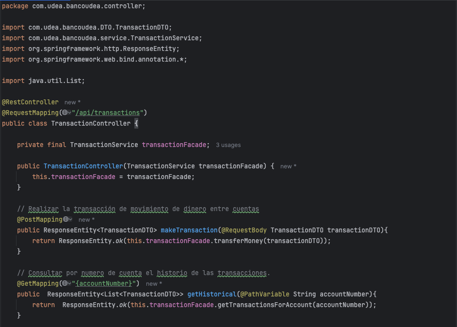
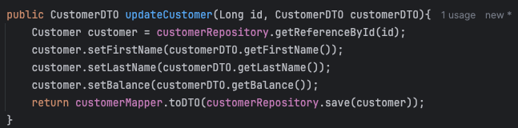
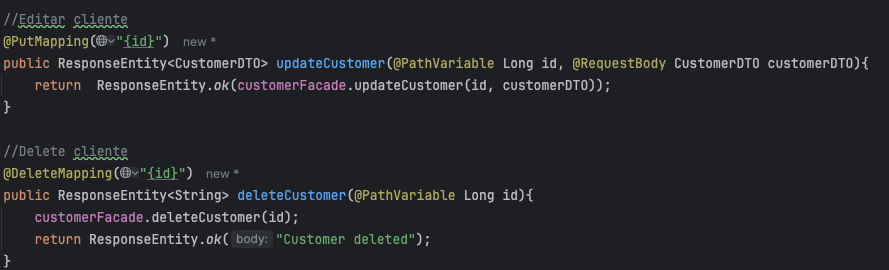

# Laboratorio 1 Banco UdeA

## Autor: Santiago Zapata Barahona

Se realizo el controlador de transaccion, permitiendo realizar una transacción de movimiento de dinero entre cuentas y 
consultar por numero de cuenta el historio de las transacciones

Tambien se agregó al servicio de Customer la logica para editar y elminar un cliente

Y en el CustomerController

